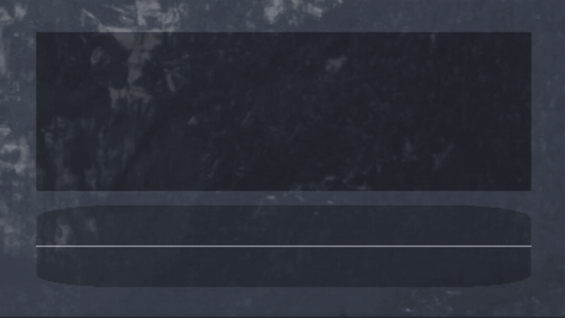

<div align="center">

# Sonori

**Transcripción de voz con IA local y superposición transparente para Linux**

Transcripción en tiempo real o bajo demanda, ejecutada enteramente en tu dispositivo.

[](LICENSE)
[](#system-requirements)
[](#compositor-wayland)

<br>



</div>

---

> **Nota:** Desarrollo activo. Es posible que encuentres errores o inestabilidad a medida que se añadan nuevas funciones.

## Características

### Núcleo
- **Procesamiento de IA Local** - Toda la transcripción ocurre en tu dispositivo, sin requerir servicios en la nube.
- **Soporte Multi-Backend** - Elige entre los backends CTranslate2, Whisper.cpp, Moonshine, Parakeet TDT o Nemotron 3.5 ASR (streaming).
- **Runtime de STT Compartido** - La captura de voz, VAD, descargas de modelos e inferencia del backend son proporcionados por el crate reutilizable [`speechcore`](https://crates.io/crates/speechcore) ([fuente](https://github.com/0xPD33/speechcore)), mantenido como una dependencia separada y descargado automáticamente durante la compilación.
- **Modos Duales de Transcripción** - Transcripción continua en tiempo real o sesiones manuales bajo demanda.
- **Detección de Actividad de Voz (VAD)** - Utiliza Silero VAD para una detección precisa del habla.
- **Descarga Automática de Modelos** - Los modelos se descargan automáticamente en la primera ejecución.

### Interfaz
- **Superposición Transparente** - Overlay no intrusivo en la parte inferior de tu pantalla.
- **Modo CLI** - Ejecución sin GUI usando el flag `--cli` para uso en terminal o headless.
- **Visualización de Audio** - Pantalla de espectrograma que muestra la entrada de audio en tiempo real.
- **Integración con la Bandeja del Sistema** - Acceso rápido con control de ventana y visualización de estado.
- **Efecto de Máquina de Escribir** - Animación de revelado de texto carácter por carácter al completarse la transcripción.

### Características Opcionales
- **Aceleración por GPU** - Renderizado basado en Vulkan; aceleración Vulkan para Whisper.cpp; aceleración GPU de ONNX Runtime para los backends Moonshine, Parakeet TDT y Nemotron 3.5 ASR.
- **Atajos Globales** - Teclas rápidas en todo el sistema vía XDG Desktop Portal (ej. Super+\ para alternar grabación).
- **Auto-Pegado** - Inyección automática de texto vía XDG Desktop Portal, con respaldo en wtype/dotool para compositores sin soporte de portal.
- **Retroalimentación Sonora** - Avisos acústicos para los cambios de estado de grabación.
- **Modo Mágico (Magic Mode)** - Post-procesamiento de transcripciones a través de un LLM local para corregir gramática, eliminar muletillas y mejorar la legibilidad.

### Hoja de Ruta
(Roadmap)

**Planeado:**
- Mejor manejo de errores y mejoras de UI.
- Soporte CUDA para aceleración por GPU.
- Backends de IA local adicionales. 
- Soporte opcional para API en la nube (Deepgram, OpenAI). 
 
**No Planeado:**
- Framework de GUI (por diseño, usa una implementación personalizada de wgpu/wgsl). 
- Soporte para Windows/macOS (contribuciones bienvenidas). 
 
## Requisitos del Sistema
 
**Plataforma:** Solo Linux x86_64. 
 
**Probado en:** NixOS con KDE Plasma/KWin y niri (Wayland). 
 
### Compositor (Wayland)
 
| Protocolo | Requerido | Propósito |
|----------|----------|---------| 
| `zwlr_layer_shell_v1` | **Sí** | Renderizado de la superposición transparente | 
| XDG Portal: GlobalShortcuts | No | Teclas rápidas globales | 
| XDG Portal: RemoteDesktop | No | Auto-pegado vía portal (respaldo: wtype/dotool) | 
 
**Compatibilidad de Compositores:** 
| Compositor | Estado | 
|------------|--------| 
| KDE Plasma (KWin) | ✅ Soporte completo | 
| niri | ✅ Soporte completo (usar IPC para atajos de teclado) | 
| Hyprland | ✅ Debería funcionar | 
| Sway | ✅ Debería funcionar | 
| GNOME (Mutter) | ❌ Sin layer shell (usar modo CLI) | 
 
### Hardware 
- **GPU:** Compatible con Vulkan y con los controladores adecuados. 
- **Audio:** Micrófono funcional, PipeWire o PulseAudio. 
 
## Instalación
 
### AppImage (Recomendado) 
 
```bash
# Descargar desde GitHub Releases
chmod +x Sonori-*-x86_64.AppImage
./Sonori-*-x86_64.AppImage
``` 
 
### Tarball de Lanzamiento
 
```bash
tar -xzf sonori-*-x86_64-linux.tar.gz
./sonori-*/sonori
``` 
 
### NixOS 
 
```bash
# Probar sin instalar
nix run github:0xPD33/sonori
 
# Instalar en el perfil
nix profile install github:0xPD33/sonori
``` 
 
O añadir a tu flake: 
```nix
{
  inputs.sonori.url = "github:0xPD33/sonori"; 
  # Luego añade: inputs.sonori.packages.${system}.default 
} 
``` 
 
### Compilación desde el Código Fuente
 
Sonori depende de [**speechcore**](https://github.com/0xPD33/speechcore) (el runtime compartido de texto a voz), que se descarga automáticamente como una dependencia de git mediante Cargo; no es necesario hacer checkout manual. Las dependencias del sistema a continuación cubren ambos crates. 
 
**Prerrequisitos:** [Rust](https://rustup.rs/) y dependencias específicas de la distribución. 
 
<details>
<summary><strong>Ubuntu/Debian 24.04+</strong></summary>
 
```bash
# Instalar dependencias del sistema 
sudo apt-get update
sudo apt-get install -y build-essential portaudio19-dev libclang-dev pkg-config \
  libxkbcommon-dev libwayland-dev libx11-dev libxcursor-dev libxi-dev libxrandr-dev \ 
  libasound2-dev libssl-dev libfftw3-dev curl cmake libvulkan-dev libopenblas-dev glslc 
 
# Instalar ONNX Runtime (no está en los repositorios) 
ONNX_VERSION=1.22.0 
wget https://github.com/microsoft/onnxruntime/releases/download/v${ONNX_VERSION}/onnxruntime-linux-x64-${ONNX_VERSION}.tgz 
tar -xzf onnxruntime-linux-x64-${ONNX_VERSION}.tgz 
sudo cp -r onnxruntime-linux-x64-${ONNX_VERSION}/include/* /usr/local/include/ 
sudo cp -r onnxruntime-linux-x64-${ONNX_VERSION}/lib/* /usr/local/lib/ 
sudo mkdir -p /usr/local/lib64 
sudo cp -r onnxruntime-linux-x64-${ONNX_VERSION}/lib/* /usr/local/lib64/ 
echo "/usr/local/lib" | sudo tee /etc/ld.so.conf.d/onnxruntime.conf 
echo "/usr/local/lib64" | sudo tee -a /etc/ld.so.conf.d/onnxruntime.conf 
sudo ldconfig 
``` 
 
Configura las variables de entorno antes de compilar: 
```bash
export BLAS_INCLUDE_DIRS=/usr/include/x86_64-linux-gnu 
export OPENBLAS_PATH=/usr 
export ORT_STRATEGY=system 
export ORT_LIB_LOCATION=/usr/local/lib 
``` 
</details> 
 
<details>
<summary><strong>Fedora/RHEL</strong></summary> 
 
```bash
sudo dnf install gcc gcc-c++ portaudio-devel clang-devel pkg-config \ 
  libxkbcommon-devel wayland-devel libX11-devel libXcursor-devel libXi-devel libXrandr-devel \ 
  alsa-lib-devel openssl-devel fftw-devel curl cmake vulkan-loader-devel vulkan-headers \ 
  openblas-devel shaderc onnxruntime-devel 
``` 
 
Configura las variables de entorno antes de compilar: 
```bash
export BLAS_INCLUDE_DIRS=/usr/include/openblas 
export OPENBLAS_PATH=/usr 
export ORT_STRATEGY=system 
``` 
</details> 
 
<details>
<summary><strong>Arch/Manjaro</strong></summary> 
 
```bash
sudo pacman -S base-devel portaudio clang pkgconf \ 
  libxkbcommon wayland libx11 libxcursor libxi libxrandr alsa-lib openssl fftw curl cmake \ 
  vulkan-headers vulkan-tools openblas shaderc 
# Instalar onnxruntime desde AUR (ej., yay -S onnxruntime) 
``` 
 
Configura las variables de entorno antes de compilar: 
```bash
export BLAS_INCLUDE_DIRS=/usr/include/openblas 
export OPENBLAS_PATH=/usr 
export ORT_STRATEGY=system 
``` 
</details> 
 
<details>
<summary><strong>NixOS</strong></summary> 
 
```bash
nix develop  # Todas las dependencias incluidas 
``` 
</details> 
 
**Compilar:** 
```bash
git clone https://github.com/0xPD33/sonori 
cd sonori 
# Asegúrate de que las variables de entorno estén configuradas (ver instrucciones arriba) 
cargo build --release 
./target/release/sonori 
``` 
 
### Integración de Escritorio 
 
**NixOS:** Automática vía Nix flake. 
 
**Otras distribuciones:** 
```bash 
./install-desktop.sh --user        # Instalación de usuario (recomendado) 
sudo ./install-desktop.sh --system # Instalación a nivel de sistema 
``` 
 
Consulta [desktop/README.md](desktop/README.md) para más detalles. 
 
## Uso 
 
### Modo GUI (Por defecto) 
 
```bash 
sonori 
``` 
 
1. Aparece una superposición transparente en la parte inferior de tu pantalla. 
2. **Modo tiempo real:** La grabación comienza automáticamente. 
3. **Modo manual:** Presiona Record para iniciar/detener sesiones. 
4. Usa los botones de la superposición para copiar texto, limpiar historial, cambiar modos o salir. 
 
### Modo CLI 
 
```bash 
sonori --cli 
``` 
 
- La transcripción aparece directamente en la terminal. 
- Modo tiempo real: inicia la grabación automáticamente. 
- Modo manual: usa la barra espaciadora para iniciar/detener. 
- `Ctrl+C` para salir. 
 
### Opciones de Línea de Comandos 
 
| Opción | Descripción | 
|--------|-------------| 
| `--cli` | Ejecutar en modo CLI sin GUI | 
| `--mode <realtime\|manual>` | Establecer modo de transcripción (defecto: manual) | 
| `--manual` | Abreviatura de `--mode manual` | 
| `--help` | Mostrar información de ayuda | 
| `--version` | Mostrar versión | 
 
### Comandos IPC (Control Externo) 
 
Controla una instancia de Sonori en ejecución mediante subcomandos de CLI. Útil para atajos de teclado del compositor en niri, sway, etc., donde el portal XDG GlobalShortcuts no esté disponible. 
 
```bash 
sonori toggle      # Alternar grabación on/off 
sonori start       # Iniciar sesión de grabación 
sonori stop        # Detener sesión de grabación 
sonori cancel      # Cancelar sesión sin procesar 
sonori status      # Obtener estado actual (JSON) 
sonori switch-mode manual|realtime 
``` 
 
**Ejemplo de atajo de niri** (`~/.config/niri/config.kdl`): 
```kdl 
binds { 
    Mod+backslash { spawn "sonori" "toggle"; } 
} 
``` 
 
## Configuración 
 
Sonori utiliza `config.toml` para la configuración. Los valores predeterminados funcionan bien para la mayoría de los usuarios. Las configuraciones nuevas usan el backend Whisper.cpp por defecto; las configuraciones de usuario existentes mantienen el backend seleccionado. 
 
**Configuración Rápida:** Elige un preajuste de la [Guía de Configuración](./CONFIGURATION.md): 
- **Rápido y Ligero (Fast & Lightweight)** - Ideal para computadoras antiguas. 
- **Rendimiento Equilibrado (Balanced Performance)** - Recomendado para la mayoría de los usuarios. 
- **Alta Calidad (High Quality)** - Para computadoras potentes con GPU. 
- **Tiempo Real (Real-Time)** - Transcripción en vivo mientras hablas. 
- **Multilingüe (Multilingual)** - Para idiomas distintos al inglés. 
- **Moonshine** - Backend basado en ONNX con rendimiento rápido en tiempo real. 
- **Parakeet TDT** - Modelo NVIDIA NeMo vía sherpa-onnx, multilingüe o solo inglés. 
- **Nemotron 3.5 ASR** - Modelo de streaming de NVIDIA (FastConformer + RNNT consciente del caché), más de 40 locales con autodetección. 
 
## Solución de Problemas 
 
### Wayland / Layer Shell 
 
Sonori utiliza `zwlr_layer_shell_v1` para la superposición transparente. 
 
- Verifica la sesión de Wayland: `echo $XDG_SESSION_TYPE` debería devolver `wayland`. 
- Revisa la tabla de [Compatibilidad de Compositores](#compositor-wayland) arriba. 
- GNOME/Mutter no soporta layer shell; usa el modo CLI (`--cli`). 
 
### Vulkan / GPU 
 
Requerido para el renderizado de la UI y la transcripción acelerada por GPU opcional. 
 
- Instala las librerías de Vulkan: `vulkan-loader`, `vulkan-headers`. 
- Pueden ser necesarios paquetes específicos del proveedor (ej., `mesa-vulkan-drivers` en Ubuntu). 
- Prueba con: `vulkaninfo` o `vkcube`. 
- Para transcripción por GPU: activa `gpu_enabled = true` en `[backend_config]`. 
 
### Funciones de XDG Desktop Portal 
 
**Atajos Globales** (`enable_global_shortcuts` en `[portal_config]`): 
- Requiere KDE Plasma 6+ o GNOME 45+. 
- Acepta el diálogo de permisos en la primera ejecución. 
- Verifica que el portal esté corriendo: `systemctl --user status xdg-desktop-portal`. 
 
**Auto-Pegado** (`enable_xdg_portal` en `[portal_config]`): 
- Utiliza el portal XDG RemoteDesktop para la inyección de teclado (KDE Plasma). 
- Usa `wtype` como respaldo cuando el portal no está disponible (sway, Hyprland, niri, river, labwc, COSMIC). 
- Usa `dotool` como último respaldo si wtype también falla (funciona en todos los compositores vía uinput; requiere pertenecer al grupo `input`). 
- Copia el texto al portapapeles vía `wl-copy` y luego simula el atajo de pegado configurado. 
 
### Problemas con los Modelos 
 
**Falla la conversión automática:** 
```bash 
# NixOS 
nix-shell model-conversion/shell.nix 
ct2-transformers-converter --model your-model --output_dir ~/.cache/speechcore/models/your-model-ct2 --copy_files preprocessor_config.json tokenizer.json 
 
# Otras distros 
pip install -U ctranslate2 huggingface_hub torch transformers 
ct2-transformers-converter --model your-model --output_dir ~/.cache/speechcore/models/your-model-ct2 --copy_files preprocessor_config.json tokenizer.json 
``` 
 
**Truncamiento de 30 segundos:** La ventana de 30 segundos de Whisper con el límite de 448 tokens puede truncar el habla densa. Soluciones: 
1. Mantén las grabaciones por debajo de los 25 segundos. 
2. Ajusta `chunk_duration_seconds` (15-25) en `[manual_mode_config]`. 
3. Prueba el backend CTranslate2. 
 
**Diseño del modelo Moonshine:** Moonshine usa modelos ONNX fusionados (descargados automáticamente) y espera un nombre de modelo como `tiny` o `base`. Si ves errores de entrada del decodificador, establece `[moonshine_options].enable_cache = false` e inténtalo de nuevo. 
 
**Diseño del modelo Parakeet:** Parakeet usa modelos ONNX divididos en INT8 vía sherpa-onnx (descargados automáticamente desde HuggingFace). Los modelos de STT se guardan en `~/.cache/speechcore/models/` por defecto. 
 
**Diseño del modelo Nemotron:** Nemotron 3.5 ASR usa modelos ONNX divididos (encoder/decoder/joint, int4) descargados automáticamente desde HuggingFace. Establece el idioma objetivo (o `auto`) mediante `[nemotron_options].language`. 
 
## Problemas Conocidos 
 
- No todos los compositores de Wayland están soportados (probado principalmente en KDE Plasma/KWin). 
- La precisión de la transcripción depende del backend y la calidad del modelo. 
- El uso de CPU puede ser alto en reposo (relacionado con el tamaño del búfer). 
 
## Contribuir 
 
¡Las contribuciones son bienvenidas! Ya sea corrigiendo errores, añadiendo funciones, mejorando la documentación o probando en diferentes distribuciones. 
 
**Para empezar:** 
- Consulta [ARCHITECTURE.md](./ARCHITECTURE.md) para entender la base de código. 
- Revisa las funciones planeadas y los problemas conocidos arriba. 
- Prueba en tu distribución. 
- Abre un issue o un PR. 
 
## Créditos 
 
- [Rust](https://www.rust-lang.org/) 
- [CTranslate2](https://github.com/OpenNMT/CTranslate2) / [Faster Whisper](https://github.com/SYSTRAN/faster-whisper) 
- [whisper.cpp](https://github.com/ggerganov/whisper.cpp) / [whisper-rs](https://codeberg.org/tazz4843/whisper-rs) 
- [ONNX Runtime](https://github.com/microsoft/onnxruntime) 
- [OpenAI Whisper](https://github.com/openai/whisper) 
- [Moonshine](https://github.com/moonshine-ai/moonshine) 
- [NVIDIA NeMo / Parakeet TDT](https://github.com/NVIDIA/NeMo) 
- [sherpa-onnx](https://github.com/k2-fsa/sherpa-onnx) 
- [Silero VAD](https://github.com/snakers4/silero-vad) 
- [CPAL](https://github.com/RustAudio/cpal) 
- [Winit Fork](https://github.com/SergioRibera/winit) 
- [WGPU](https://github.com/gfx-rs/wgpu) 
 
## Licencia 
 
Licencia MIT - consulta [LICENSE](LICENSE) para más detalles.
